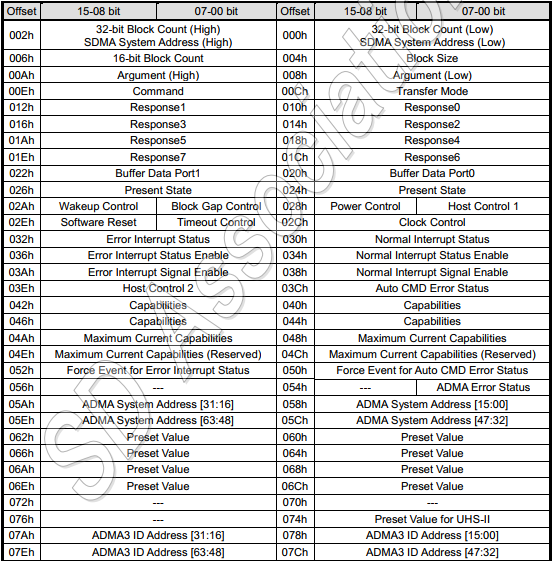
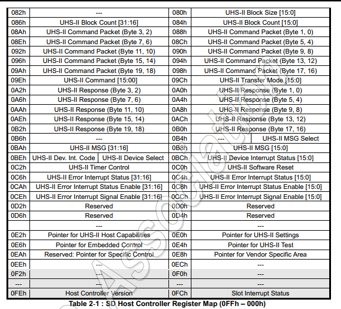

# **Linux mmc driver**

## **关于linux mmc driver的相关文件**

在`linux/driver/mmc`下，有两个文件夹，其中core是SD卡驱动的核心代码，实现一些SD卡驱动的功能，host是对应各种不同的硬件接口，两者通过共享`include/linux/mmc/mmc.h`、`include/linux/mmc/sd.h`等库中的接口进行协作，这样对于不同的硬件，core的代码无需更换，只需要在编译时编译不同的host代码。

### **core**

关于core中代码，其作用为：

`block.c/block.h`: 这些文件处理与块设备接口有关的功能，例如读取或写入数据块。

`bus.c/bus.h`: 这些文件处理与MMC/SD卡总线接口有关的功能，例如处理设备注册和注销。

`card.h`: 定义了与特定卡类型相关的信息和操作。

`core.c/core.h`: 这些是驱动程序的核心文件，包含了大部分的主要功能和接口。其中包括读写请求过程（初始化，开始请求，等待其他请求完成，完成请求,cqe）host或card相关（声明，释放），调谐，总线设置，硬件设置（信号电压，设备编号，供电，断电，重启，设备检测），擦除

`crypto.c/crypto.h`: 这些文件处理与内联加密有关的功能。

`debugfs.c`: 此文件提供了用于调试的接口。

`host.c/host.h`: 这些文件处理与主机控制器接口有关的功能。

`mmc.c/mmc_ops.c:` 这些文件处理与MMC卡操作有关的功能。

`mmc_test.c`: 此文件包含了用于测试驱动程序的代码。包括两部分，分别是测试相关的数据准备和包装，以及测试的直接代码，其中具体的测试内容包括读写（基础读写，多块读写，幂块读写，非对齐读写，奇怪大小块读写，损坏读写）读写效率测试（普通效率，效率随大小变化），擦除效率，从散列表页面上的随机读写和顺序读写，读写过程中发送命令（非阻塞和阻塞）

`pwrseq.c/pwrseq.h/pwrseq\_\*.c:` 这些文件处理与电源序列（pwrseq）有关的功能，电源序列用于启动和关闭设备。

`queue.c/queue.h`: 这些文件处理与请求队列有关的功能，请求队列用于管理数据块的读写请求。

`quirks.h`: 此文件包含了对特定硬件行为的处理。

`regulator.c`: 此文件处理与电压和电流调节有关的功能。

`sd.c/sd_ops.c`: 这些文件处理与SD卡操作有关的功能。

`sdio.c/sdio\_\*.c`: 这些文件处理与SDIO（SD Input/Output）接口有关的功能，SDIO接口用于将SD卡作为输入/输出设备使用。

`slot-gpio.c`: 此文件处理与GPIO（General Purpose Input/Output）插槽检测有关的功能。

### **host**

对于树莓派来说，如果我们查看linux的文件设备树，即`bcm2710-rpi-4-b.dts`，可以知道其mmc驱动使用的是bcm2835-mmc或bcm2835-sdhci，优先使用bcm2835-mmc。于是我总结了以下`sdhci.c`以及`bcm2835-mmc.c`中的代码。

```
mmc@7e300000 {
			compatible = "brcm,bcm2835-mmc\0brcm,bcm2835-sdhci";
			reg = <0x7e300000 0x100>;
			interrupts = <0x00 0x7e 0x04>;
			clocks = <0x08 0x1c>;
			status = "disabled";
			pinctrl-names = "default";
			pinctrl-0 = <0x13>;
			bus-width = <0x04>;
			dmas = <0x0c 0x0b>;
			dma-names = "rx-tx";
			brcm,overclock-50 = <0x00>;
			phandle = <0x3a>;
		};

```

#### **sdhci.c**

`sdhci.c`中的代码分为以下几部分：

Low level function:包括检查v4模式，检测卡是否插入，总线开启关闭，复位，设置中断，设置dma，激活led，设置计时器

Core function:直接读写数据块（而不是dma，似乎只有在中断处理中才会用到），dma传输前准备，dma传输后处理，dma设置,timeout设置，中断设置，数据初始化，传输设置，发送指令（包括重试），时钟设置，电源设置。

Mmc callbacks:可以被外界调用的函数，包括：发起请求，设置带宽、信号模式，设置参数以及预设值，获取卡状态，硬件复位，启用、清除中断，信号电压切换，调谐。

Request done:完成工作或者超时后的处理

Interrupt handling:中断处理

Suspend/resume：暂停和恢复

cqe相关函数

设备分配和注册

初始化与退出

#### **bcm2835-mmc.c**

相对sdhci.c内容要少很多，只有传输请求，中断以及一些基础的设置。不过多了通过cpu直接传输数据的功能。

## **linux mmc driver的工作原理以及调用栈**

### **driver的注册**

linux 中使用platform_driver结构体抽象平台设备

```c
struct platform_driver {
    int (*probe)(struct platform_device *);

    /*
     * Traditionally the remove callback returned an int which however is
     * ignored by the driver core. This led to wrong expectations by driver
     * authors who thought returning an error code was a valid error
     * handling strategy. To convert to a callback returning void, new
     * drivers should implement .remove_new() until the conversion it done
     * that eventually makes .remove() return void.
     */
    int (*remove)(struct platform_device *);
    void (*remove_new)(struct platform_device *);

    void (*shutdown)(struct platform_device *);
    int (*suspend)(struct platform_device *, pm_message_t state);
    int (*resume)(struct platform_device *);
    struct device_driver driver;
    const struct platform_device_id *id_table;
    bool prevent_deferred_probe;
    /*
     * For most device drivers, no need to care about this flag as long as
     * all DMAs are handled through the kernel DMA API. For some special
     * ones, for example VFIO drivers, they know how to manage the DMA
     * themselves and set this flag so that the IOMMU layer will allow them
     * to setup and manage their own I/O address space.
     */
    bool driver_managed_dma;
};
```

在linux的init程序`init/main.c`中，通过调用initcall进行初始化操作，包括驱动的初始化。其中会通过`platform_driver_register`进行设备注册。`platform_driver_register`注册时把 `platform_drv_probe`赋值给`drv-\>driver.probe`。然后`driver_register`调用了`driver_probe_device`，里面又调用了`really_probe`，里面通过`drv-\>probe`调用了`drv-\>driver.probe`，也就是调用了`platform_drv_probe`。其中传入的参数是`device \*dev`，`dev_prv = to_device_private_bus`，`dev = dev_prv-\>device`。猜测dev由设备树匹配过来。`platform_drv_probe`中又获取了`xxx_probe`的指针，最后调用到编写的`xxx_probe`。

补充：进一步调查发现platform_driver_register是platform_add_devices调用的

### **读写操作**

我们以`mmc_test.c`中的base write case为例,研究mmc driver在数据读写时的调用栈。

`mmc_test.c`中的`mmc_test_run`函数先调用`mmc_test_prepare_write`（`\_\_mmc_test_prepare`的包装)进行准备工作，包括设置块大小，初始化buffer,调用`mmc_test_buffer_transfer`传一个block进行测试。之后调用`mmc_test_verify_write`，在使用`sg_init_one`进行段初始化后，进入`mmc_test_transfer`，完成设置块大小等工作后，进行完整的传输（传多个块，其中每个块的传输用的都是`mmc_test_buffer_transfer`）

而在`mmc_test_buffer_transfer`中，进行了段初始化，mrq的初始化后，调用`core.c`中的`mmc_wait_for_req`，这个函数会尝试直接用`\_\_mmc_start_req`开始传输请求，如果已经有传输，就用`mmc_wait_for_req_done`等待其他传输完成再进行。

在`\_\_mmc_start_req`中，先进行设备的retune,然后等待host不忙之后，先关闭cqe，再调用`host-\>ops-\>request`发送请求。

host相关的request方法在不同的硬件上是不同的，在`sdhci.c`中，request的方法在`sdhci_request`中,其调用了`sdhci_send_command_retry`，这个函数会调用`sdhci_send_command`，如果失败就重新调用

在`sdhci_send_command`中，确定sd卡不忙且数据没有被阻塞后进行一些设置（包括数据初始化，寄存器设置，dma准备）后通过writel设置寄存器设置SDHCI_COMMAND发送命令完成一次传输。

### **电源操作**

我们以关电源为例研究driver是如何对设备的硬件进行操作的。

在`core.c`中，有一个函数`mmc_power_off`，他会将`host-\>ios.power_mode`设置为`MMC_POWER_OFF`后调用`mmc_set_initial_state`，这个函数会在设置一些总线带宽等信息之后调用`mmc_set_ios`，这个函数会调用`host-\>ops-\>set_ios`

`在sdhci.c`中，对应`sdhci_set_ios`，他会对包括电源在内的一系列信息进行设置，在电源的部分，会调用`host-\>ops-\>set_power`设置电源状态（如果没有这个函数的话就调用`sdhci_set_power`），在`sdhci_set_power`中，如果电压没有问题，会调用`sdhci_set_power_reg`，通过设置寄存器进行电源操作。

```C
static void sdhci_set_power_reg(struct sdhci_host *host, unsigned char mode,
                unsigned short vdd)
{
    struct mmc_host *mmc = host->mmc;

    mmc_regulator_set_ocr(mmc, mmc->supply.vmmc, vdd);

    if (mode != MMC_POWER_OFF)
        sdhci_writeb(host, SDHCI_POWER_ON, SDHCI_POWER_CONTROL);
    else
        sdhci_writeb(host, 0, SDHCI_POWER_CONTROL);
}
```


### **相关数据结构**

**struct mmc_host**

mmc设备的抽象。包括锁、计时器、中断等的配置，当前的请求以及数据、dma设置等。由于完整定义较长，就不列举了。

**struct mmc_host_ops**

mmc设备对外暴露的操作接口。完整定义较长，只展示在sdhci.c中的实现。

```C
static const struct mmc_host_ops sdhci_ops = {
    .request    = sdhci_request,
    .post_req   = sdhci_post_req,
    .pre_req    = sdhci_pre_req,
    .set_ios    = sdhci_set_ios,
    .get_cd     = sdhci_get_cd,
    .get_ro     = sdhci_get_ro,
    .card_hw_reset  = sdhci_hw_reset,
    .enable_sdio_irq = sdhci_enable_sdio_irq,
    .ack_sdio_irq    = sdhci_ack_sdio_irq,
    .start_signal_voltage_switch    = sdhci_start_signal_voltage_switch,
    .prepare_hs400_tuning       = sdhci_prepare_hs400_tuning,
    .execute_tuning         = sdhci_execute_tuning,
    .card_event         = sdhci_card_event,
    .card_busy  = sdhci_card_busy,
};
```

**struct mmc_request**

对mmc的请求。包括命令内容，其中附带的数据，请求的host等。

```C
struct mmc_request {
    struct mmc_command  *sbc;       /* SET_BLOCK_COUNT for multiblock */
    struct mmc_command  *cmd;
    struct mmc_data     *data;
    struct mmc_command  *stop;

    struct completion   completion;
    struct completion   cmd_completion;
    void            (*done)(struct mmc_request *);/* completion function */
    /*
     * Notify uppers layers (e.g. mmc block driver) that recovery is needed
     * due to an error associated with the mmc_request. Currently used only
     * by CQE.
     */
    void            (*recovery_notifier)(struct mmc_request *);
    struct mmc_host     *host;

    /* Allow other commands during this ongoing data transfer or busy wait */
    bool            cap_cmd_during_tfr;

    int         tag;

#ifdef CONFIG_MMC_CRYPTO
    const struct bio_crypt_ctx *crypto_ctx;
    int         crypto_key_slot;
#endif
};
```

**struct mmc_ios**

mmc的输入输出设置。

```C
struct mmc_ios {
    unsigned int    clock;          /* clock rate */
    unsigned short  vdd;
    unsigned int    power_delay_ms;     /* waiting for stable power */

/* vdd stores the bit number of the selected voltage range from below. */

    unsigned char   bus_mode;       /* command output mode */

#define MMC_BUSMODE_OPENDRAIN   1
#define MMC_BUSMODE_PUSHPULL    2

    unsigned char   chip_select;        /* SPI chip select */

#define MMC_CS_DONTCARE     0
#define MMC_CS_HIGH     1
#define MMC_CS_LOW      2

    unsigned char   power_mode;     /* power supply mode */

#define MMC_POWER_OFF       0
#define MMC_POWER_UP        1
#define MMC_POWER_ON        2
#define MMC_POWER_UNDEFINED 3

    unsigned char   bus_width;      /* data bus width */

#define MMC_BUS_WIDTH_1     0
#define MMC_BUS_WIDTH_4     2
#define MMC_BUS_WIDTH_8     3

    unsigned char   timing;         /* timing specification used */

#define MMC_TIMING_LEGACY   0
#define MMC_TIMING_MMC_HS   1
#define MMC_TIMING_SD_HS    2
#define MMC_TIMING_UHS_SDR12    3
#define MMC_TIMING_UHS_SDR25    4
#define MMC_TIMING_UHS_SDR50    5
#define MMC_TIMING_UHS_SDR104   6
#define MMC_TIMING_UHS_DDR50    7
#define MMC_TIMING_MMC_DDR52    8
#define MMC_TIMING_MMC_HS200    9
#define MMC_TIMING_MMC_HS400    10
#define MMC_TIMING_SD_EXP   11
#define MMC_TIMING_SD_EXP_1_2V  12

    unsigned char   signal_voltage;     /* signalling voltage (1.8V or 3.3V) */

#define MMC_SIGNAL_VOLTAGE_330  0
#define MMC_SIGNAL_VOLTAGE_180  1
#define MMC_SIGNAL_VOLTAGE_120  2

    unsigned char   drv_type;       /* driver type (A, B, C, D) */

#define MMC_SET_DRIVER_TYPE_B   0
#define MMC_SET_DRIVER_TYPE_A   1
#define MMC_SET_DRIVER_TYPE_C   2
#define MMC_SET_DRIVER_TYPE_D   3

    bool enhanced_strobe;           /* hs400es selection */
};

struct mmc_clk_phase {
    bool valid;
    u16 in_deg;
    u16 out_deg;
};

#define MMC_NUM_CLK_PHASES (MMC_TIMING_MMC_HS400 + 1)
struct mmc_clk_phase_map {
    struct mmc_clk_phase phase[MMC_NUM_CLK_PHASES];
};
```

## **硬件相关操作**

之前提到过sdhci通过写寄存器来操作SD卡，下面是相关的写代码

```C
//drivers\mmc\host\bcm2835-sdhost.c
static inline void bcm2835_sdhost_write(struct bcm2835_host *host, u32 val, int reg)
{
    writel(val, host->ioaddr + reg);
}
//arch/arc/include/asm/io.h
#define writeb(v,c)     ({ __iowmb(); writeb_relaxed(v,c); })
#define writew(v,c)     ({ __iowmb(); writew_relaxed(v,c); })
#define writel(v,c)     ({ __iowmb(); writel_relaxed(v,c); })

#define writeb_relaxed(v,c) __raw_writeb(v,c)
#define writew_relaxed(v,c) __raw_writew((__force u16) cpu_to_le16(v),c)
#define writel_relaxed(v,c) __raw_writel((__force u32) cpu_to_le32(v),c)

#define __raw_writeb __raw_writeb
static inline void __raw_writeb(u8 b, volatile void __iomem *addr)
{
    __asm__ __volatile__(
    "   stb%U1 %0, %1   \n"
    :
    : "r" (b), "m" (*(volatile u8 __force *)addr)
    : "memory");
}

#define __raw_writew __raw_writew
static inline void __raw_writew(u16 s, volatile void __iomem *addr)
{
    __asm__ __volatile__(
    "   stw%U1 %0, %1   \n"
    :
    : "r" (s), "m" (*(volatile u16 __force *)addr)
    : "memory");

}

#define __raw_writel __raw_writel
static inline void __raw_writel(u32 w, volatile void __iomem *addr)
{
    __asm__ __volatile__(
    "   st%U1 %0, %1    \n"
    :
    : "r" (w), "m" (*(volatile u32 __force *)addr)
    : "memory");

}
```

一直到汇编代码，读写寄存器操作在操作系统的视角看起来就是在向一个特定的地址写内容，那么如何确定这个特殊的地址呢。

### **关于寄存器的基地址**

在上面bcm2835_sdhost_write函数中，我们看到写的目的地址是基地址host->ioaddr加偏移reg。在probe中，有一个函数确定了设备的基地址

```c
//drivers\mmc\host\bcm2835-sdhost.c
host->ioaddr = devm_platform_get_and_ioremap_resource(pdev, 0, &iomem);
```

其定义如下,其中,resourse应当是在设备树中确定的资源，设备的起始地址应当就是在res-\>start中，而后面的步骤就是在把这个物理地址映射到操作系统中。

```c
//drivers\base\platform.c
void __iomem *
devm_platform_get_and_ioremap_resource(struct platform_device *pdev,
                unsigned int index, struct resource **res)
{
    struct resource *r;

    r = platform_get_resource(pdev, IORESOURCE_MEM, index);
    if (res)
        *res = r;
    return devm_ioremap_resource(&pdev->dev, r);
}
```

#### 资源寻找

在`platform_get_resource`中，会访问`*dev`的所有资源然后返回想要的种类，这些资源应当是在设备树文件中

```c
//drivers\base\platform.c
struct resource *platform_get_resource(struct platform_device *dev,
                       unsigned int type, unsigned int num)
{
    u32 i;

    for (i = 0; i < dev->num_resources; i++) {
        struct resource *r = &dev->resource[i];

        if (type == resource_type(r) && num-- == 0)
            return r;
    }
    return NULL;
}
```

其中的dev的传递路径是bus_for_each_dev中由next_device(&i)进行遍历。而在其中，i来自klist_iter_init_node，即设备链表，应该是由设备树得到的。

&bus->p->klist_devices来自于drv->bus，来自于platform_bus_type，其注册在bus.c定义的函数bus_register(&platform_bus_type)中，其中的p的klist_devices来自于klist_init(&priv->klist_devices, klist_devices_get, klist_devices_put);

#### 资源映射

`\_\_devm_ioremap_resource`函数首先检查传入的资源是否有效和是内存资源。然后它为资源生成一个"pretty name"，这个名字是设备名字和资源名字的组合（如果资源有名字的话）。然后，它尝试请求资源对应的内存区域（`devm_request_mem_region()`）。如果这个请求成功，它将尝试映射这个内存区域（`\_\_devm_ioremap()`）。如果映射成功，函数返回映射得到的虚拟地址。如果任何步骤失败，它将返回一个错误指针。

```c
//lib\devres.c
void __iomem *devm_ioremap_resource(struct device *dev,
                    const struct resource *res)
{
    return __devm_ioremap_resource(dev, res, DEVM_IOREMAP);
}

static void __iomem *
__devm_ioremap_resource(struct device *dev, const struct resource *res,
            enum devm_ioremap_type type)
{
    resource_size_t size;
    void __iomem *dest_ptr;
    char *pretty_name;

    BUG_ON(!dev);

    if (!res || resource_type(res) != IORESOURCE_MEM) {
        dev_err(dev, "invalid resource\n");
        return IOMEM_ERR_PTR(-EINVAL);
    }

    if (type == DEVM_IOREMAP && res->flags & IORESOURCE_MEM_NONPOSTED)
        type = DEVM_IOREMAP_NP;

    size = resource_size(res);

    if (res->name)
        pretty_name = devm_kasprintf(dev, GFP_KERNEL, "%s %s",
                         dev_name(dev), res->name);
    else
        pretty_name = devm_kstrdup(dev, dev_name(dev), GFP_KERNEL);
    if (!pretty_name) {
        dev_err(dev, "can't generate pretty name for resource %pR\n", res);
        return IOMEM_ERR_PTR(-ENOMEM);
    }

    if (!devm_request_mem_region(dev, res->start, size, pretty_name)) {
        dev_err(dev, "can't request region for resource %pR\n", res);
        return IOMEM_ERR_PTR(-EBUSY);
    }

    dest_ptr = __devm_ioremap(dev, res->start, size, type);
    if (!dest_ptr) {
        dev_err(dev, "ioremap failed for resource %pR\n", res);
        devm_release_mem_region(dev, res->start, size);
        dest_ptr = IOMEM_ERR_PTR(-ENOMEM);
    }

    return dest_ptr;
}
//请求资源部分在kernel\resource.c中，就是加锁等操作
struct resource *
__devm_request_region(struct device *dev, struct resource *parent,
              resource_size_t start, resource_size_t n, const char *name)
{
    struct region_devres *dr = NULL;
    struct resource *res;

    dr = devres_alloc(devm_region_release, sizeof(struct region_devres),
              GFP_KERNEL);
    if (!dr)
        return NULL;

    dr->parent = parent;
    dr->start = start;
    dr->n = n;

    res = __request_region(parent, start, n, name, 0);
    if (res)
        devres_add(dev, dr);
    else
        devres_free(dr);

    return res;
}
```

\_\_devm_ioremap函数首先尝试分配一个设备资源（device resource），这个设备资源用来保存映射后的虚拟地址。然后根据映射类型，使用对应的ioremap函数（ioremap(), ioremap_uc(), ioremap_wc() 或 ioremap_np()）进行内存映射，然后检查映射是否成功。

如果映射成功，将映射后的虚拟地址保存在设备资源中，并将设备资源添加到设备的devres列表中。然后函数返回映射后的虚拟地址。

如果映射失败，释放之前分配的设备资源，然后函数返回NULL。

ioremap 函数，它将物理地址映射到虚拟地址空间。物理地址 offset 和 size 指定了需要映射的物理内存区域。先使用 mutex_lock 获取 regions_mtx 互斥体，确保同一时间只有一个线程可以执行这个函数的内容。遍历 regions_list 列表，查找第一个包含要映射的物理内存区域的区域。

如果找到了，然后再在 mapped_areas 数组中找一个空闲的区域（ops 字段为空表示该区域是空闲的）。

如果找到了空闲区域，调用找到的 logic_iomem_region 的 map 方法对物理内存进行映射，并获取映射后的虚拟地址偏移，如果映射失败（map 方法返回值小于0），则将 ops 字段置空，并退出循环。

如果映射成功，计算映射后的虚拟地址（注意，这个地址是偏移地址，实际的虚拟地址需要加上 IOREMAP_BIAS），并退出循环。

如果没有找到适合的 logic_iomem_region 或者 mapped_areas 没有空闲区域，那么调用 real_ioremap 进行映射。

使用 mutex_unlock 释放 regions_mtx 互斥体。

返回映射后的虚拟地址。

### **关于寄存器的排布**

关于寄存器偏移的问题：

通过https://github.com/raspberrypi/documentation/issues/1209这篇问答，知道了读写sd卡时通过gpio的48-53接口。但是通用的gpio接口好像不能实现上面的功能。

由https://ultibo.org/wiki/Unit_BCM2711知道默认连接到sd卡插槽的emmc2遵循sdhci标准

查阅sd标准也确实和linux源码中的寄存器地址排布一样。





