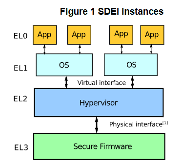
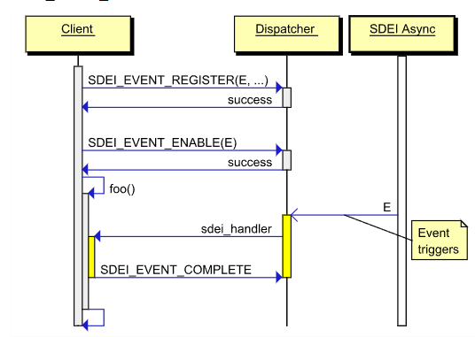

# arm中的sdei机制
时间：2023.7.7

作者：李柯樾

## 简介
SDEI（Software Delegated Exception Interface）提供了一种从系统固件注册和服务系统事件（system events）的机制。arm官方文档定义了接口的标准，具体实现依赖于固件厂家。接口由Secure platform firmware向Hypervisor或hypervisor向OS提供。

## 定义
### Software Delegated Exception
SDEI机制利用将System events陷入到更高特权级的方式来达到抢占低特权级执行的效果，这被称作Software Delegated Exception.
### Client and dispatcher
SDE是高特权级与低特权级之间的软件约定。将高优先级的事件委托给低特权级处理。其中高特权级被称为Dispatcher，它处理来自低特权级的事件，并将其委托出去。

低特权级被称为Client，它用dispatcher提供的接口来处理事件。

### Event
事件可由硬件或软件中断产生，它首先会由Dispatcher处理，然后它通过 **IMPLEMENTATION DEFINED**机制将事件交由Client处理。
### Event Type
私有事件只能由产生对应事件的PE进行处理，类似于PPI。
共享事件可以由一组PE中的某个PE处理，根据路由模式选择目标，类似于SPI。
## 实现
SDEI可由EL3的固件实现，向Hypervisor提供服务，也可由hypervisor实现，向OS提供服务，也可以同时存在。VM不能直接调用固件提供的SDEI接口。
接口调用通过SMC或者HVC实现。

## System requirements
### PE 
ARMv8-A 支持EL2、EL3.
### Interrupt controller
推荐GIC，推荐在实现SDEI机制的时候尽可能利用GIC来减少软件开销。
## Interface
### SDEI calls
Client通过SMC或者HVC进行SDEI调用，调用规范依赖于SMC Calling Conventions。SDEI相关接口如果没有实现，会返回NOT_SUPPORTED error code=-1。

实现了SDEI的实例应该支持下列接口
- SDEI_VERSION SDEI实现版本，依赖于固件实现，常用于测试平台是否支持SDEI
- SDEI_EVENT_REGISTER 为一个特定event注册一个handler。参数包括： 

    - event id：可能是由dispatcher提供的或者由SDEI_INTERRUPT_BIND动态绑定的，arm官方规范只规定了0号为Software signaled event，其余由固件自定义。
    - entry_point_address handler的入口地址
    - ep_argument 自定义参数
    - flag 决定地址是一个absolute address or relative to the Vector Base Address Register以及决定路由模式RM_PE/RM_ANY
    - affinity 当路由模式为RM_PE时用于指定target PE。
- SDEI_EVENT_ENABLE
- SDEI_EVENT_DISABLE
- SDEI_EVENT_CONTEXT
- SDEI_EVENT_COMPLETE
- SDEI_EVENT_SIGNAL 可以向目标PE发送一个0 号event，参数为affinity
- SDEI_INTERRUPT_BIND 可以将一个PPI或者SPI绑定到一个event id 上，不能绑定SGI,PPI将作为私有事件，SPI为共享事件。
....

## Event handler states：

## Event register and handling

## 各个固件对SDEI的支持[blog](https://blog.csdn.net/hunan4222/article/details/81138206)
### APEI对SDEI的支持

ACPI-v6.2开始增加对SDEI的支持，作为一种Hardware Error Notification方式。
这样，APEI表就包含以下11中Notification类型:
0 – Polled
1 – External Interrupt
2 – Local Interrupt
3 – SCI
4 – NMI
5 - CMCI
6 - MCE
7 - GPIO-Signal
8 - ARMv8 SEA
9 - ARMv8 SEI
10 - External Interrupt - GSIV
11 - Software Delegated Exception – See Links to ACPI-Related Documents (http://uefi.org/acpi) under the heading, “SDEI Specification.”

### TF对SDEI的支持

./include/services/sdei.h
sdei_dispatch_event()应该是在BIOS的RAS driver里面调用。
void begin_sdei_synchronous_dispatch(struct jmpbuf *buffer);
./services/std_svc/sdei/sdei_dispatch.S
汇编实现的dispatch函数，同步dispatch
int setjmp(struct jmpbuf *buf);
./lib/aarch64/setjmp.S

### UEFI对SDEI的支持

Trust firmware需要升级到TF1.5。
UEFI增加一个SDEI表，用来与OS对齐版本信息。
UEFI使能TF中的SDEI功能，需要做什么还没搞清楚
UEFI收到system event之后，比如RAS中断，调用TF提供的以下API，通知SDEI Client。
int sdei_dispatch_event(int ev_num);

### OS对SDEI的支持
HEST中定义了vector，作为event_num用于sdei_event_register()
sdei_event_create()添加到sdei_list

_sdei_event_register() --> _local_event_register() --> invoke_sdei_fn() --> sdei_firmware_call()
sdei_firmware_call有两种实现方式，HVC和SMC，通过acpi或者DTS表选择。
sdei_event_enable --> sdei_api_event_enable() --> invoke_sdei_fn

[arm官方文档](https://documentation-service.arm.com/static/615440b72912074055f172df)

[TF-A实现](https://github.com/ARM-software/arm-trusted-firmware/blob/master/docs/components/sdei.rst)