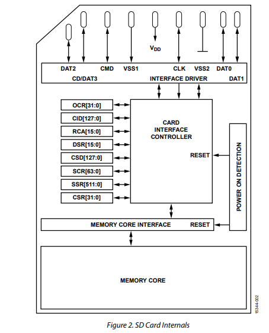
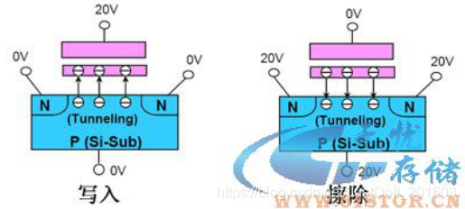

# SD卡工作原理

## SD卡基本介绍

SD卡是SecureDigitalCard的英文缩写，直译就是“安全数字卡”，正式缩写为SD，是SD协会开发的一种专有 的非易失性 存储卡格式，用于便携式设备。由于它体积小、数据传输速度快、可热插拔等优良的特性，被广泛地于便携式装置上使用。

该标准于1999年8月由SanDisk，松下（MatsushitaElectric）和东芝共同努力推出，作为对MultiMediaCard（MMC）的改进，现已成为行业标准。这三家公司组成了SD-3C，LLC，这家公司许可并执行与SD存储卡以及SD主机和辅助产品相关的知识产权。

两家公司还于2000年1月成立了非营利组织SD协会（SDA），以促进和创建SD卡标准。SDA如今有大约1,000个成员公司。SDA使用SD-3C拥有并许可的多个商标徽标，以强制遵守其规范并确保用户的兼容性。

SD卡的内部结构如下：

SD卡按容量分类，可以分为3类：SD卡、SDHC卡、SDXC卡，如下：

| 容量   | 命名                             | 简称                    |
| ------ | -------------------------------- | ----------------------- |
| 0~2G   | Standard Capacity SD Memory Card | SDSC或SD（使用1.0标准） |
| 2G~32G | Standard Capacity SD Memory Card | SDHC（使用2.0标准）     |
| 32G~2T | Extended Capacity SD Memory Card | SDXC（使用3.0标准）     |

按照接口分类，可以分为UHS-I卡和UHS-II卡。

- UHS-I：UHS-I 是 SD 卡的第一个 UHS 版本，通过引入额外的接触点和改进的通信协议，提供了较高的传输速度，最高可达 104MB/s。
- UHS-II：UHS-II 是 SD 卡的第二个 UHS 版本，它在接口设计上进行了进一步改进，引入了双线程传输和更高的时钟频率，以提供更高的速度和更高的传输效率。UHS-II 接口最高可达 312MB/s 的数据传输速度。

除了 SD 存储卡外，还有 SD I/O (SDIO) 卡。 SDIO 规范定义了可以包含各种 I/O 单元和 SD 主机之间的接口的 SD 卡。 SDIO 卡可能包含内存存储功能及其 I/O 功能。 SDIO 卡的内存部分应完全兼容给定的物理层规范。 SDIO 卡基于 SD 存储卡并与其兼容。

目前市面上的大多数卡是2代以上、UHS-I的卡，其结构如下

下面我们从外到内介绍SD卡的对外通信、内部控制以及存储原理。

## SPI

关于SD卡与外界的传输，SD卡在传输时分为两个模式，SPI与SD。其区分在于，在上电后发送的第一个命令如果是CMD0，则会进入SPI模式。

在SPI读写时，host与card之间通信情况如下：

其中，command与response的格式可以在手册中查阅，不再赘述。

在信号传输的层面上，命令与回复的内容如下

其中，H代表高电压（逻辑1）L代表低电压（逻辑0）X代表无关，Z代表高阻抗

## card interface controller

关于SD卡内部的传输，在SD卡中有card interface controller管理卡的核心存储器。 该控制器通常处理写入、读取、闪存中数据的擦除、错误处理和闪存磨损。 因此，SD卡的主控制器实际上是通过card interface controller现命令与数据的传输，而不用关心存储核心的管理。

SD卡内部控制器的结构应当属于商业机密，目前来说我没有找到相关的文档或者介绍。

## 闪存

SD卡存储部分的本质是一种NAND闪存，其中NAND全称为"NOT AND"，代表与非门；nand闪存就是利用若干个与非门构成逻辑架构。与其他存储器相比，nand闪存的价格更加实惠，同时具有较高的容量和读写速度等特点。

### 闪存原理

与正常闪存一样，NAND闪存用三端器件作为存储单元，分别为源极、漏极和栅极，与场效应管的工作原理相同，主要是利用电场的效应来控制源极与漏极之间的通断，栅极的电流消耗极小，不同的是场效应管为单栅极结构，而FLASH为双栅极结构，在栅极与硅衬底之间增加了一个浮置栅极。浮置栅极是由氮化物夹在两层二氧化硅材料之间构成的，中间的氮化物就是可以存储电荷的电荷势阱。上下两层氧化物的厚度大于50埃，以避免发生击穿。通俗来说，闪存的原理是通过在浮动栅极上施加电压，可以将电子捕获在栅极中，从而改变晶体管的导电性。这种捕获电子的状态可以长期保持，即使断开电源也不会丢失。

### 读写

向数据单元内写入数据的过程就是向电荷势阱注入电荷的过程，写入数据有两种技术，热电子注入(hot electron injection)和F-N隧道效应(Fowler Nordheim tunneling)，前一种是通过源极给浮栅充电，后一种是通过硅基层给浮栅充电。NOR型FLASH通过热电子注入方式给浮栅充电，而NAND则通过F-N隧道效应给浮栅充电。在写入新数据之前，必须先将原来的数据擦除，这点跟硬盘不同，也就是将浮栅的电荷放掉，两种FLASH都是通过F-N隧道效应放电。

具体过程为：在充电过程中，通过在源极和栅极之间施加适当的电场，创建一个强电场区域，电场方向是从源极指向栅极。当电场应用后，绝缘层中的电子受到电场的影响，可以以量子隧道的方式穿过绝缘层。当电子通过 F-N 隧道效应进入绝缘层后，它们在浮栅上会产生电荷，从而改变浮栅的电荷状态。这样，浮栅就可以存储数据，例如逻辑 1 或逻辑 0。

### 编码

#### 0&1

与正常闪存相同一样，向浮栅中注入电荷表示写入了'0'，没有注入电荷表示'1'，所以对FLASH清除数据是写1的，这与硬盘正好相反；

对于浮栅中有电荷的单元来说，由于浮栅的感应作用，在源极和漏极之间将形成带正电的空间电荷区，这时无论控制极上有没有施加偏置电压， 晶体管都将处于导通状态。而对于浮栅中没有电荷的晶体管来说只有当控制极上施加有适当的偏置电压，在硅基层上感应出电荷，源极和漏极才能导通，也就是说在 没有给控制极施加偏置电压时，晶体管是截止的。

如果晶体管的源极接地而漏极接位线，在无偏置电压的情况下，检测晶体管的导通状态就可以获得存储单元中的数据，如果位线上的电平为低， 说明晶体管处于导通状态，读取的数据为0，如果位线上为高电平，则说明晶体管处于截止状态，读取的数据为1。由于控制栅极在读取数据的过程中施加的电压较 小或根本不施加电压，不足以改变浮置栅极中原有的电荷量，所以读取操作不会改变FLASH中原有的数据。

#### 连接和编址方式

两种FLASH具有相同的存储单元，工作原理也一样，为了缩短存取时间并不是对每个单元进行单独的存取操作，而是对一定数量的存取单元 进行集体操作，NAND型FLASH各存储单元之间是串联的，而NOR型FLASH各单元之间是并联的；为了对全部的存储单元有效管理，必须对存储单元进 行统一编址。

NAND的全部存储单元分为若干个块，每个块又分为若干个页，每个页是512byte，就是512个8位数，就是说每个页有512条位线，每条位线下有8个存储单元；那么每页存储的数据正好跟硬盘的一个扇区存储的数据相同，这是设计时为了方便与磁盘进行数据交换而特意安排的，那么块就类 似硬盘的簇；容量不同，块的数量不同，组成块的页的数量也不同。在读取数据时，当字线和位线锁定某个晶体管时，该晶体管的控制极不加偏置电压，其它的7个 都加上偏置电压而导通，如果这个晶体管的浮栅中有电荷就会导通使位线为低电平，读出的数就是0，反之就是1。

NOR的每个存储单元以并联的方式连接到位线，方便对每一位进行随机存取；具有专用的地址线，可以实现一次性的直接寻址；缩短了FLASH对处理器指令的执行时间。

