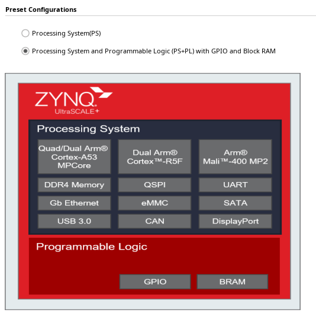
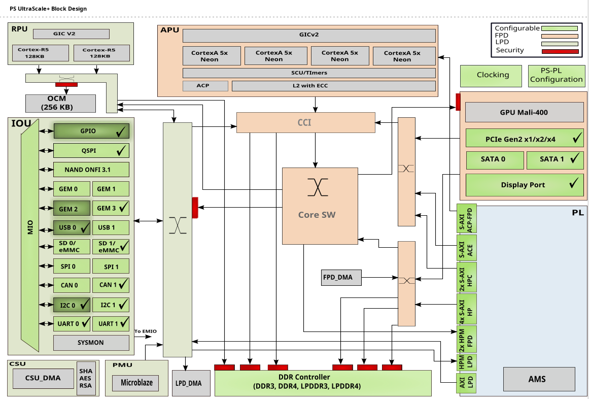
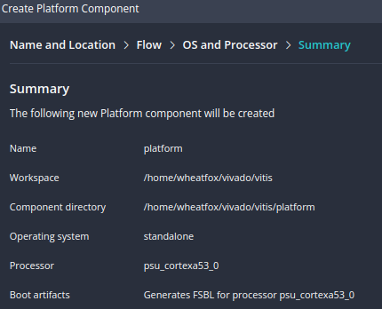
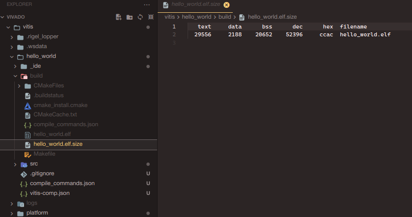
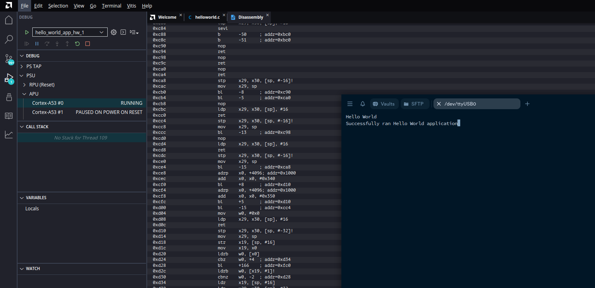

# Xilinx Ultrascale ZCU201 研究记录

wheatfox

## 10月30日记录

在vivado里试着创建一个ZCU102的example project，架构如下：




其中ZYNQ即SoC上的ARM硬核，其通过AXI互联和GPIO/FPGA BRAM相连，默认的模板引出了GPIO[7:0]的8个LED位。ZYNQ架构的block design如下：

**RPU** - Real-Time Processing Unit：负责实时处理任务，通常运行更简单的操作系统或实时操作系统（RTOS）。

**APU** - Application Processing Unit：负责执行更复杂的操作，通常运行通用操作系统（如Linux）。

**OCM** - On-Chip Memory：片上内存，用于存储一些关键的操作数据或代码。

**IOU** - Input/Output Unit：用于处理输入输出外设的单元。

**MIO** - Multiplexed I/O：多路复用I/O，用于连接外部设备。

**CCI** - Cache Coherent Interconnect：缓存一致性互联，支持多核之间的数据一致性。

**Core SW** - Core Switch：用于内部连接和数据交换的核心开关。

**FPD** - Full Power Domain：全功率域，通常用于高性能操作。

**LPD** - Low Power Domain：低功率域，用于节能操作。

**CSU** - Configuration and Security Unit：配置和安全单元，负责系统配置和安全性。

**PMU** - Power Management Unit：电源管理单元，负责系统的电源控制和管理。

**PL** - Programmable Logic：可编程逻辑区，用于用户自定义逻辑设计，位于图中右下角部分。

**AMS** - Analog Mixed Signal：模拟混合信号区，用于处理模拟信号的转换和处理。

**GPU Mali-400** - 图形处理单元：用于图形加速，Mali-400是ARM公司的一款GPU。

**SD/eMMC** - Secure Digital/Embedded MultiMediaCard：存储设备接口，用于连接SD卡或嵌入式存储。

**ACP** - Accelerator Coherency Port：这是一个加速器一致性端口，允许外设和加速器直接访问处理器缓存，从而实现更高效的数据传输和更好的系统性能。

**ECC** - Error Correction Code：错误校正码，用于检测和纠正存储器中的单比特错误，确保数据的完整性。通常在关键的数据路径（如缓存和主存储器）中使用。

**SCU** - Snoop Control Unit：用于管理多核系统中处理器缓存之间的一致性，确保多个处理器对共享数据的一致访问。

**MicroBlaze** - 这是Xilinx提供的一种32位RISC软处理器，专门为FPGA设计。它可以被用户在可编程逻辑（PL）中实例化，实现自定义逻辑控制或应用。

记录一下重要的数据：

1. PSS_REF_CLK 33.33MHz
2. PCIe 100MHz Link Speed 5Gb/s
3. SATA 126MHz
4. DP 27MHZ
5. USB0 26MHz
6. DDR4 1067MHz
7. UART0和1的baud 115200

UART0  PS_UART0 (MIO 18-19)

UART1  PS_UART1 (MIO 20-21)

UART2  PL-UART (HD Bank 49)

UART3  U41 System Controller UART

### Hello World in Vivado and Vitis 2024

在完成block design之后，首先需要导出这个硬件描述，才能让vitis拿到自己的PS系统所面向的硬件结构

File - Export - Export Hardware

之后会得到一个xsa文件，对于vitis来说就是输入一个xsa，然后编译得到对应结构上的elf程序

打开vitis IDE，打开一个workspace，之后创建一个新的platform component，创建时选择刚刚的xsa文件：


之后vitis会自动开始生成我们xsa的设备树，然后进入OS和CPU选择，OS可以选择standalone、freerots、linux，CPU这里选A53的application cpu。



第一次创建出现报错： cmake: error while loading shared libraries: libssl.so.10: cannot open shared object file: No such file or directory

cmake: error while loading shared libraries: libcrypto.so.10: cannot open shared object file: No such file or directory

```bash
➜  ~ whereis libssl.so
libssl.so: /usr/lib/x86_64-linux-gnu/libssl.so
➜  x86_64-linux-gnu ls | grep ssl
libssl3.so
libssl.a
libssl.so
libssl.so.1.1
libssl.so.3
libxmlsec1-openssl.so.1
libxmlsec1-openssl.so.1.2.37

➜  x86_64-linux-gnu ls | grep crypto
libbd_crypto.so.2
libbd_crypto.so.2.0.0
libcrypto.a
libcrypto.so
libcrypto.so.1.1
libcrypto.so.3
libk5crypto.so.3
libk5crypto.so.3.1
libmbedcrypto.so.2.28.3
libmbedcrypto.so.7
```

vitis的cmake要的libssl的版本位1.0.0，从源码编译一个安装

https://openssl-library.org/source/old/1.0.0/index.html

```bash
./config shared zlib-dynamic
➜  openssl-1.0.0 sudo cp libcrypto.so.1.0.0 /usr/lib/x86_64-linux-gnu/
➜  openssl-1.0.0 sudo cp libssl.so.1.0.0 /usr/lib/x86_64-linux-gnu 
➜  x86_64-linux-gnu sudo ln -s libssl.so.1.0.0 libssl.so.10
➜  x86_64-linux-gnu sudo ln -s libcrypto.so.1.0.0 libcrypto.so.10
sudo ldconfig
```

然后就可以正常创建platform了

添加一个hello world工程，左下角build后就可以在build目录得到elf文件：



https://xilinx.github.io/Embedded-Design-Tutorials/docs/2023.1/build/html/docs/Introduction/ZynqMPSoC-EDT/4-build-sw-for-ps-subsystems.html

在vitis魔改的vscode IDE中启动调试，通过termius开一个ttyUSB0的115200串口，然后可以看到PS系统的APU成功发送了hello world：



但是每次debug启动时都会有xsdb脚本报错segmentation fault然后卡很久，从apt安装一个rlwrap然后把xilinx自带的那个没法运行的换掉：

https://adaptivesupport.amd.com/s/question/0D54U00006lApRISA0/immediate-segfault-when-running-xsdb?language=en_US

```bash
sudo apt install rlwrap
➜  ~ mv /tools/Xilinx/Vitis/2024.1/bin/unwrapped/lnx64.o/rlwrap /tools/Xilinx/Vitis/2024.1/bin/unwrapped/lnx64.o/rlwrap.bak
➜  ~ ln -s `which rlwrap` /tools/Xilinx/Vitis/2024.1/bin/unwrapped/lnx64.o/rlwrap
```

然后就没问题了。

> rlwrap是gnu readline工具中的一个（https://linux.die.net/man/1/rlwrap），其能够提供对任何command或程序的用户输入历史记录保存（上下箭头切换）、自定义补全等。xilinx使用rlwrap允许自己的xsdb debug程序

### 什么是petalinux

petalinux是amd提供的一个嵌入式linux的**SDK**，包括：

1. yocto extensible SDK
2. XSCT工具链（Xilinx Software Commandline Tools）
3. petalinux CLI tools

https://xilinx-wiki.atlassian.net/wiki/spaces/A/pages/18841937/Zynq+UltraScale+MPSoC+Ubuntu+part+2+-+Building+and+Running+the+Ubuntu+Desktop+From+Sources 这里有一份为zcu102编译好的ubuntu desktop镜像，不过之后可能要自己修改linux，所以还是需要学一下petalinux工具链

### 安装petalinux SDK

文档 https://docs.amd.com/r/en-US/ug1144-petalinux-tools-reference-guide/Overview

下载地址 https://www.xilinx.com/support/download/index.html/content/xilinx/en/downloadNav/embedded-design-tools.html

安装完成后的基本命令表：

|                            设计流程步骤 | 工具/工作流程                                    |
| --------------------------------------: | :----------------------------------------------- |
|          硬件平台创建（仅用于定制硬件） | AMD Vivado™ 设计工具                             |
|                     创建 PetaLinux 项目 | `petalinux-create project`                       |
| 初始化 PetaLinux 项目（仅用于定制硬件） | `petalinux-config --get-hw-description`          |
|                          配置系统级选项 | `petalinux-config`                               |
|                            创建用户组件 | `petalinux-create apps petalinux-create modules` |
|                             配置 U-Boot | `petalinux-config -c u-boot`                     |
|                         配置 Linux 内核 | `petalinux-config -c kernel`                     |
|                          配置根文件系统 | `petalinux-config -c rootfs`                     |
|                                构建系统 | `petalinux-build`                                |
|                          打包以部署系统 | `petalinux-package`                              |
|                        启动系统进行测试 | `petalinux-boot`                                 |
|                              升级工作区 | `petalinux-upgrade`                              |
|                 使用 Yocto 开发工具命令 | `petalinux-devtool`                              |
|                            使用调试工具 | `petalinux-util`                                 |