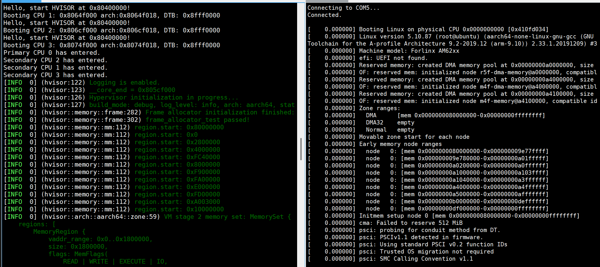

# hvisor适配ok6254开发板

时间：2025/6/4

作者：侯云龙


# 0. ok6254开发板相关知识

[01_AM62X简介](https://forlinx-book.yuque.com/wl9002/ligiet/uf6t5hneigb2nes0)-核心板

[03_OK62xx-C嵌入式开发平台介绍](https://forlinx-book.yuque.com/wl9002/ligiet/vx43ckb0bazphd2y)-开发板接口相关

[06_开发板系统烧写](https://forlinx-book.yuque.com/wl9002/ligiet/edhhragnmlykha6y)-烧录

[04_相关代码编译](https://forlinx-book.yuque.com/wl9002/ligiet/uvhqnayx5nzz1nrz)-Linux编译/设备树获取

# 1. 开发板适配使用hvisor

[hvisor 硬件适配开发手册 - hvisor 手册](https://hvisor.syswonder.org/chap01/PlatformDev.html)

[hvisor如何适配新板子——以aarch64 rk3568为例](https://kindly-tellurium-6bf.notion.site/hvisor-aarch64-rk3568-1c11786f530480928d00e93f9f7801c7)

## 1.1 设置hvisor的输出调试串

`src/device/uart/uart_16550.rs`：参考设备树文件设置输出串口的及地址

```rust
#[cfg(feature = "uart_base_ok6254")]
pub const UART_BASE: PhysAddr = 0x2800000;
```

或

编写裸板程序，确定串口输出所使用的uart寄存器等

添加`src/device/uart/ok6254_uart.rs`文件，

并在`src/device/uart/mod.rs`文件中添加该串口相关配置信息

## 1.2 platform文件结构

```
platform/aarch64/ok6254-c
├── board.rs 
├── cargo
│   ├── config.template.toml
│   └── features
├── configs
│   ├── virtio_cfg.json
│   └── zone1-linux.json
├── image
│   └── dts
│       ├── Makefile
│       ├── zone0.dts
│       ├── zone1.dts
│       └── zone1-linux.dts
├── linker.ld
└── platform.mk
```

board.rs：添加zone0设备树地址/内核加载地址/内核入口地址/RAM映射区域/IO映射区域/ROOT Liunx irq/gicd,gicr,gicc,gich,gicv,gits的基地址和大小，见后续**启动zone0**

features：对应的具体cargo features，uart

virtio_cfg.json：见后续**启动zone1**

zone1-linux.json：见后续**启动zone1**

zone0.dts：zone0设备树-基本上是原有设备树

zone1.dts：zone1设备树-精简后的设备树

linker.ld：hvisor链接文件，修改相关启动地址

platform.mk：修改hvisor地址，zone0kernel，dtb地址

## 1.3 加载启动hvisor

通过uboot将sd卡中hvisor.bin和OK6254-C.dtb设备树文件加载到内存并启动（或可通过tftp传输）

查看sd卡中文件

```
mmc list
mmc dev 1
mmcinfo
fatls mmc 1:1
```

加载hvisor并启动

```
load mmc 1:1 0x80000000 OK6254-C.dtb
load mmc 1:1 0x80400000 hvisor.bin
md 0x80000000 0x100
md 0x80400000 0x100
bootm 0x80400000 - 0x80000000
```

正常在开发板上启动hvisor


## 1.4 hvisor适配开发板过程中遇到的问题汇总

1. hvisor无法使用串口输出：确定串口驱动类型  或  编写裸板程序，确定串口输出所使用的uart寄存器等，再编写hvisor的串口输出的相关代码详细流程如下：用C语言写一个裸板程序，用交叉编译工具链编译链接，使用uboot将裸板程序加载到内存，然后go启动运行；能够成功通过串口输出调试信息则将其转成rust语言并添加`src/device/uart/ok62xx_uart.rs`，参考[UART 16550的使用-CSDN博客](https://blog.csdn.net/qq_45226456/article/details/142097210)

# 2. 通过hvisor启动zone0

## 2.1 启动zone0涉及的文件

```
platform/aarch64/ok6254-c
├── board.rs 
├── image
│   └── dts
│       ├── zone0.dts
```

### 2.1.1 zone0.dts

`zone0.dts`:zone0启动的设备树文件，详见[zone0设备树](https://github.com/ohhhHwH/hvisor/blob/dev/platform/aarch64/ok6254-c/image/dts/zone0.dts)

添加hvisor_virtio_device设备树节点

```dts
hvisor_virtio_device {
		compatible = "hvisor";
		interrupt-parent = <0x01>;
		interrupts = <0x00 0x20 0x01>;
	};
```

设置zone0的reserved-memory，将zone1启动位置设置为no-map

```
nonroot@b0000000 {
    no-map;
    reg = <0x00 0xb0000000 0x00 0x2f000000>;
};
```

删除zone1所需要的设备节点，使zone0和zone1所使用的设备节点不冲突

### 2.1.2 board.rs

`board.rs`:zone0启动的配置文件

```rust
// zone0 设备树文件加载地址
pub const ROOT_ZONE_DTB_ADDR: u64 = 0x88000000; 
// zone0 内核加载地址
pub const ROOT_ZONE_KERNEL_ADDR: u64 = 0x82000000; 
// zone0 内核启动地址
pub const ROOT_ZONE_ENTRY: u64 = 0x82000000; 
// zone0启动时所要使用的CPU
pub const ROOT_ZONE_CPUS: u64 = (1 << 0) | (1 << 1); 
```

根据zone0设备树所设定的设备节点，在board.rs上分配相同的地址空间给zone0

```
serial@2b300000 {
    compatible = "ti,am64-uart\0ti,am654-uart";
    reg = <0x00 0x2b300000 0x00 0x100>;
    interrupts = <0x00 0xba 0x04>;
};
```

根据reg = <0x00 0x2b300000 0x00 0x100>;

```rust
// hvisor分配给zone0的地址空间
pub const ROOT_ZONE_MEMORY_REGIONS: [HvConfigMemoryRegion; 12] = [
    HvConfigMemoryRegion {
        mem_type: MEM_TYPE_RAM,
        physical_start: 0x2b300000 ,
        virtual_start: 0x2b300000 ,
        size: 0x100,
    }, // serial@2b300000
];
```

> gic中断设备不需要分配相应的地址，相应中断由hvisor接管，但仍需在设备树中保留gic中断设备

根据zone0设备树所设定的设备中断号，在board.rs的ROOT_ZONE_IRQS上配置中断地址

```rust
// hvisor接管zone0中断号
pub const ROOT_ZONE_IRQS: [u32; 13];
```

根据zone0设备树找到相应中断控制器的设备节点，并将中断设备的相应地址与大小填写在ROOT_ARCH_ZONE_CONFIG中

```rust
// gic控制器相关地址信息
pub const ROOT_ARCH_ZONE_CONFIG: HvArchZoneConfig = HvArchZoneConfig;
```

## 2.2 启动zone0

通过sd卡加载加载hvisor镜像设备树，zone0设备树，镜像，并启动hvisor

```
load mmc 1:1 0x90000000 OK6254-C-linux.dtb
load mmc 1:1 0x90400000 Image
load mmc 1:1 0x80000000 OK6254-C.dtb
load mmc 1:1 0x80400000 hvisor.bin
bootm 0x80400000 - 0x80000000
```

成功启动zone0-linux


## 2.3 hvisor启动zone0中遇见的问题汇总

1.多核启动问题

ROOT_ZONE_CPUS启动CPU 0b1111代表启动四个核

```rust
pub const ROOT_ZONE_CPUS: u64 = (1 << 0) | (1 << 1) |  (1 << 2)|  (1 << 3);
```

2.gic初始化问题-gic相关地址从设备树中获取

```dts
interrupt-controller@1800000 {
            compatible = "arm,gic-v3";
            #address-cells = <0x02>;
            #size-cells = <0x02>;
            ranges;
            #interrupt-cells = <0x03>;
            interrupt-controller;
            reg = <0x00 0x1800000 0x00 0x10000 0x00 0x1880000 0x00 0xc0000>;
            interrupts = <0x01 0x09 0x04>;
            phandle = <0x01>;

            msi-controller@1820000 {
                compatible = "arm,gic-v3-its";
                reg = <0x00 0x1820000 0x00 0x10000>;
                socionext,synquacer-pre-its = <0x1000000 0x400000>;
                msi-controller;
                #msi-cells = <0x01>;
                phandle = <0x63>;
            };
        };
```

3.内存覆盖问题

出现异常内存访问，需要在broad.rs的ROOT_ZONE_MEMORY_REGIONS中将其内存范围进行映射


4.linux启动过程中卡死

对比正常启动liunx的logo信息，确定没有启动的设备或异常访问的内存范围


5.内核vfs挂载失败

设备树中chosen选择相应的挂载位置

# 3. 在zone0中使用hvisor-tool启动zone1


## 3.1 编译hvisor-tool

[Hvisor 管理工具 - hvisor 手册](https://hvisor.syswonder.org/chap04/subchap04/ManageTools.html)

[hvisor-tool README-zh](https://github.com/syswonder/hvisor-tool/blob/main/README-zh.md)

## 3.2 hvisor-tool启动配置文件

详见：[ZONE的配置与管理 - hvisor 手册](https://hvisor.syswonder.org/chap03/ZoneConfig.html#non-root-zones配置)

[zone1-linux-virtio.json](https://github.com/ohhhHwH/hvisor/blob/dev/platform/aarch64/ok6254-c/configs/zone1-linux-virtio.json)

id：启动non root的id号

memory_region：non root所使用的内存地址范围等信息

devices：non root所使用的virtio设备

[zone1-linux.json](https://github.com/ohhhHwH/hvisor/blob/dev/platform/aarch64/ok6254-c/configs/zone1-linux.json)

映射zone1需要的io设备、virtio设备内存地址和ram区域（类似于board.rs）

## 3.3 zone1设备树修改

精简zone1设备树，保留必要的设备节点,并保证zone0所占用的设备/地址不冲突。

保留节点

```
timer-cl0-cpu0
interrupt-controller@1800000
pinctrl@f4000
serial@2800000
cpus
```

裁剪后设备树见:
[zone1-linux.dts](https://github.com/ohhhHwH/hvisor/blob/dev/platform/aarch64/ok6254-c/image/dts/zone1-linux.dts)


添加virtio blk等virtio设备节点

```
 // virtio blk
    virtio_mmio@a003c00 {
        dma-coherent;
        interrupt-parent = <0x01>;
        interrupts = <0x0 0x2e 0x1>;
        reg = <0x0 0xa003c00 0x0 0x2000>;  
        compatible = "virtio,mmio";
    };
```

将所使用的serial@2800000的依赖时钟更换成fix-clock

```
serial@2800000 {
    clocks = <0xbf 0x92 0x00>; // change to fix clock
};

clk_uart_fixed {
    compatible = "fixed-clock";
    #clock-cells = <0x00>;
    clock-frequency = <0x2dc6c00>; // 48MHz
    phandle = <0xbf>;
};
```

## 3.4 hvisor-tool启动zone1

[启动两个VM：Linux1 和 Linux2 - hvisor 手册](https://hvisor.syswonder.org/chap03/BootNonRootLinux.html)


```shell
# zone0挂载zone1的相关指令
#切换到sd卡目录下
cd /run/media/mmcblk1p1 
# 加载hvisor-tool内核驱动
insmod hvisor.ko
mount -t proc proc /proc
mount -t sysfs sysfs /sys
rm nohup.out
mkdir -p /dev/pts
mount -t devpts devpts /dev/pts

# 启动nohup守护进程，处理virtio相关请求
nohup ./hvisor virtio start virtio_cfg.json &
# 启动zone1
./hvisor zone start zone1-linux.json && cat nohup.out | grep "char device" && script /dev/null

# hvisortool管理相关指令
./hvisor zone list
./hvisor zone shutdown -id 1
```

## 3.5 zone1启动过程中所遇到的问题

1.hvisor-tool加载hvisor.ko内核模块运行提示没有virtio-device：没有添加设备树节点

2.root linux运行./hvisor提示glibc版本不匹配：hvisor-tool未指定正确的文件系统路径


3.linux启动过程中卡死：对比正常启动liunx的logo信息，确定没有启动的设备或异常访问的内存范围

4.zone1启动导致zone0的mmc卡死：zone1占用了zone0的中断控制器导致zone0无法收到中断

5.zone1启动后物理串口设备未成功启动：zone1的物理串口使用的时钟被zone0占用，需要修改为fix clock

6./bin/sh后未正常输出：zone1.json中未正确配置相关中断，sh程序需要串口的相关中断才能正常运行。